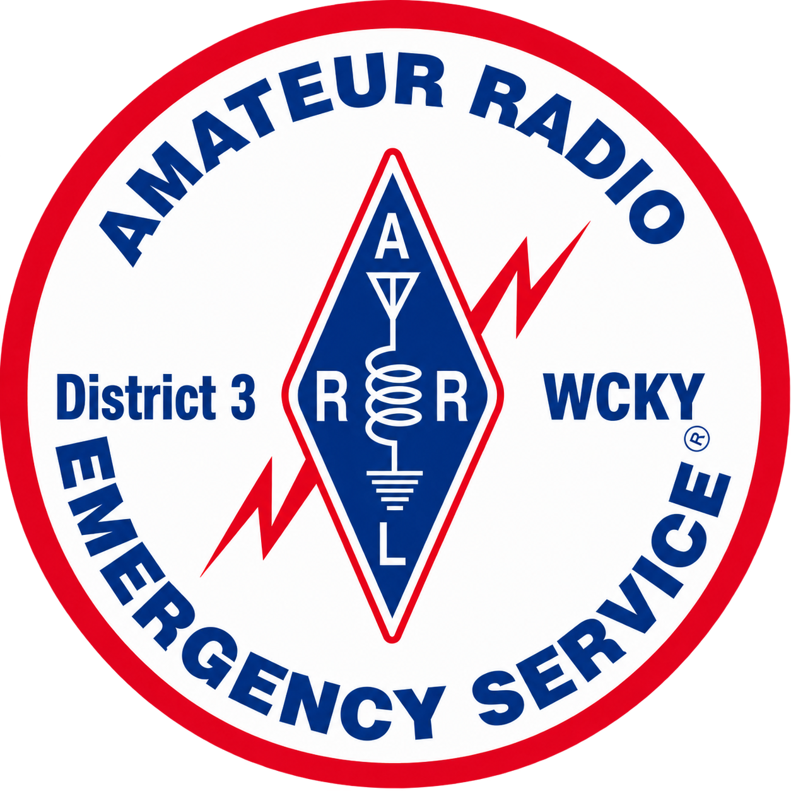

# WCKY ARES - Kentucky District 3 Warren County

  

# Members Training Progress

| Task                     | ROE |  Level | EC KQ4TIV | K4WKU | K9CHS | KD9GRD | KY4JPS |
|--------------------------|:---:|:------:|:---------:|:-----:|:-----:|:------:|:------:|
| IS-100                   |  R  |  BASIC |     X     |       |   X   |        |    X   |
| IS-700                   |  R  |  BASIC |     X     |   X   |   X   |        |    X   |
| IS-200                   |  E  |  BASIC |     X     |       |       |        |    X   |
| IS-800                   |  E  |  BASIC |     X     |       |       |        |    X   |
| SKYWARN BASIC            |  O  |  BASIC |     X     |       |       |        |        |
| EMCOMM BASIC             |  R  |  BASIC |     X     |       |   X   |        |        |
| OBTAIN TASKBOOK          |  R  |  BASIC |     X     |   X   |   X   |    X   |    X   |
| JOIN ARES GROUP          |  R  |  BASIC |     X     |   X   |   X   |    X   |    X   |
| TECH LICENSE             |  R  |  BASIC |     X     |   X   |   X   |    X   |    X   |
| IS-100                   |  R  | INTERM |     X     |       |   X   |        |    X   |
| IS-700                   |  R  | INTERM |     X     |   X   |   X   |        |    X   |
| IS-200                   |  R  | INTERM |     X     |       |       |        |    X   |
| IS-800                   |  R  | INTERM |     X     |       |       |        |    X   |
| IS-802                   |  E  | INTERM |           |       |       |        |        |
| EMCOMM INTERM            |  R  | INTERM |           |       |       |        |        |
| SKYWARN BASIC            |  E  | INTERM |     X     |       |       |    X   |    X   |
| NET PARTICIPATION        |  R  | INTERM |     X     |   X   |   X   |    X   |    X   |
| PUBLIC SERVICE EVENT     |  E  | INTERM |           |       |       |        |        |
| SET OR EXERCISE PART     |  O  | INTERM |           |       |       |        |        |
| SERVE AS NCS             |  O  | INTERM |     X     |       |       |        |        |
| PROGRAM TONE HT          |  R  | INTERM |     X     |       |       |        |        |
| PROGRAM FREQ/OFF         |  R  | INTERM |     X     |       |       |        |        |
| WRITE/SEND ICS-213       |  R  | INTERM |           |       |       |        |        |
| OP VHF DIGITAL           |  O  | INTERM |           |       |       |        |        |
| OP UNIT SPEC DIGI VHF/HF |  O  | INTERM |     X     |       |       |        |        |
| BUILD DIPOLE             |  R  | INTERM |     X     |       |       |        |        |
| BUILD POWERPOLE CABLE    |  E  | INTERM |     X     |       |       |        |        |
| SOLDER PL259             |  E  | INTERM |     X     |       |       |        |        |
| ASSY 24HR GO KIT         |  E  | INTERM |           |       |       |        |        |
| IS-317                   |  O  | INTERM |           |       |       |        |        |
| IS-120                   |  R  |  ADVAN |           |       |       |        |        |
| IS-230                   |  R  |  ADVAN |           |       |       |        |        |
| IS-235                   |  R  |  ADVAN |           |       |       |        |        |
| IS-240                   |  R  |  ADVAN |           |       |       |        |        |
| IS-241                   |  R  |  ADVAN |           |       |       |        |        |
| IS-242                   |  R  |  ADVAN |           |       |       |        |        |
| IS-244                   |  R  |  ADVAN |           |       |       |        |        |
| IS-288                   |  R  |  ADVAN |           |       |       |        |        |
| IS-2200                  |  R  |  ADVAN |           |       |       |        |        |
| IS-802                   |  R  |  ADVAN |           |       |       |        |        |
| EMCOMM ADVANCED          |  R  |  ADVAN |           |       |       |        |        |
| SKYWARN ADVANCED         |  O  |  ADVAN |           |       |       |        |        |
| PR-101                   |  O  |  ADVAN |           |       |       |        |        |
| AUXCOM                   |  E  |  ADVAN |           |       |       |        |        |
| ICS-300                  |  E  |  ADVAN |           |       |       |        |        |
| ICS-400                  |  E  |  ADVAN |           |       |       |        |        |
| COML                     |  O  |  ADVAN |           |       |       |        |        |
| COMT                     |  O  |  ADVAN |           |       |       |        |        |
| NET PARTICIPATION        |  R  |  ADVAN |     X     |   X   |   X   |    X   |    X   |
| PUBLIC SERVICE EVENT     |  R  |  ADVAN |           |       |       |        |        |
| SET OR EXERCISE PART     |  R  |  ADVAN |           |       |       |        |    X   |
| SERVE AS NCS             |  R  |  ADVAN |     X     |   X   |       |        |        |
| PRESENT TRAINING         |  R  |  ADVAN |     X     |       |       |        |        |
| HOLD LEADERSHIP          |  R  |  ADVAN |     X     |       |       |        |        |
| GENERAL LICENSE          |  O  |  ADVAN |           |       |       |        |        |
| PR-101                   |  R  |  ADVAN |           |       |       |        |        |
| EC-001                   |  O  |  ADVAN |           |       |       |        |        |
| PROF IN ICS FORMS        |  R  |  ADVAN |           |       |       |        |        |
| OP VHF DIGITAL P2P       |  R  |  ADVAN |           |       |       |        |        |
| OP HF DIGI MESSAGE       |  R  |  ADVAN |     X     |       |       |        |        |
| PROGRAM TONE HT          |  R  |  ADVAN |     X     |       |       |        |        |
| PROGRAM FREQ/OFF         |  R  |  ADVAN |     X     |       |       |        |        |
| CROSSBAND REPEAT MOBILE  |  O  |  ADVAN |           |       |       |        |        |
