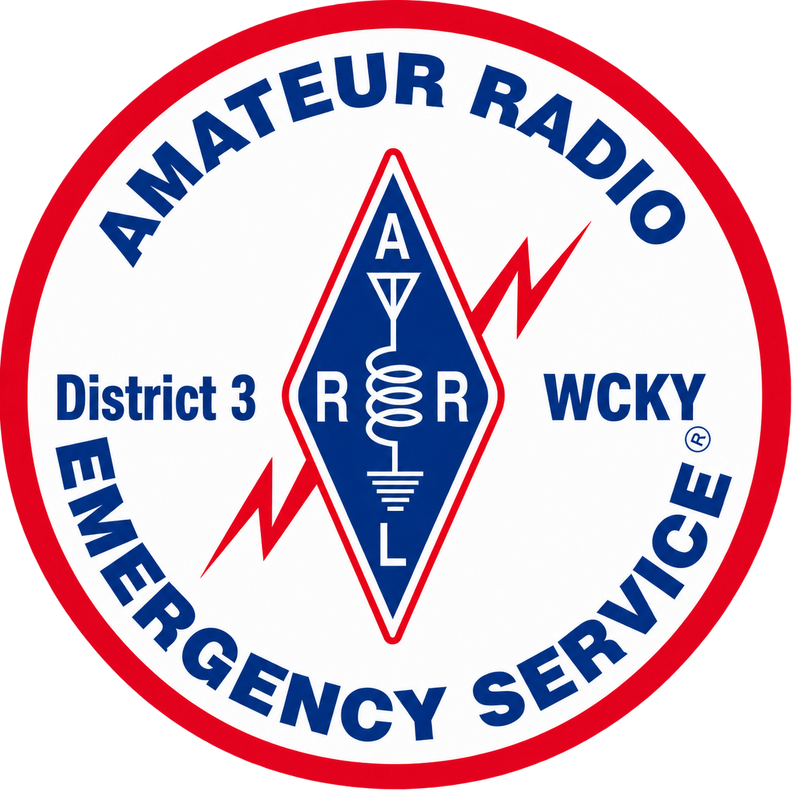

# WCKY ARES

  

# Field Resources Manual - Revised 2026.08.28

### Downloads
  * [PDF - Letter Size](wcky_ares_op_01_20260824_letter.pdf)
  * [PDF - A4 Size](wcky_ares_op_01_20260824_a4.pdf)

## 1.0 Introduction

We as members of The Kentucky District 3 Warren County ARES strive to be an effective partner in emergency/disaster response, providing the citizens and public service/safety partners with communications expertise, situational awareness and capabilities of professional communicators.  We will accomplish this mission by utilizing our equipment, expertise, skills and capabilities as Amateur Radio Operators to effectively pass message traffic, provide accurate and detailed situation reports, and be active during field exercises.  We strive to be supportive in times of need in our local communities and beyond.

**Remember:** Secure your family and your home first.  Do not respond until they are safe and well provided for.

## 2.0 Table of Contents

* [1.0 Introduction](#1.0-introduction)
* [2.0 Table of Contents](#2.0-table-of-contents)
* [3.0 Purpose](#3.0-purpose)
* [4.0 Scope](#4.0-scope)
* [5.0 Definitions and Acronyms](#5.0-definitions-and-acronyms)
* [6.0 Resources](#6.0-resources)
  * [6.0.1 Contacts](#601-contacts)                                                  
  * [6.0.2 Served Agencies](#602-served-agencies)                                    
  * [6.0.3 Band Plan](#603-band-plan)                                                
  * [6.0.4 Rally Points](#604-rally-points)                                          
  * [6.0.5 Building a Dipole Antenna](#605-building-a-dipole-antenna)                
  * [6.0.6 End Fed Half Wave Antennas](#606-end-fed-half-wave-antennas)              
  * [6.0.7 Building a 2m/70cm Rollup Antenna](#607-building-a-2m70cm-rollup-antenna) 
  * [6.0.8 Assembling Anderson Power Poles](#608-assembling-anderson-power-poles)    
  * [6.0.9 Preambles](#609-preambles)                                                
  * [6.1 Agreements](#61-agreements)                                                 
* [7.0 Pro Word Dictionary](#70-pro-word-dictionary)                               
* [8.0 Revision History](#80-revision-history)                                     

## 3.0 Purpose

The purpose of this document is to document necessary resources for WCKY ARES operation.  This is to commonize knowledge and allocation of said resources in times of general emergency or upon activation by a served agency, if these resources are needed.

## 4.0 Scope

The listed resources are only applicable to the WCKY ARES group and not necessarily those of any other Region, Section, or Division of ARES or of any particular other agency, though nothing in this document excludes them to being used for those purposes.

## 5.0 Definitions and Acronyms

* EC - Emergency Coordinator
* AEC - Assistant Emergency Coordinator, appointed by EC
* LACO - Local ARES Communications Officer, usually the EC, who is the ultimate decision maker for all emergency communications operations for the local ARES group
* NCS - Net Control Station
* EOC - Emergency Operations Center
* NVIS - Near Vertical Incident Skywave, an HF antenna closer to the ground than $\\lambda$/2 to the ground, especially good for regional communication or hilly terrain

## 6.0 Resources

### 6.0.1 Contacts

|Title|Callsign|Name        |email                   |Phone Number |
|:---:|--------|------------|------------------------|-------------|
|EC   |KQ4TIV  |Nathan Butts|nathanielbutts@gmail.com|(270)991-4641|
|SEC  |W2QN    |Dennis Lutz |dennislutz2@aol.com     |             |
|SM   |K6ZZ    |Bob Selbrede|k6zz@arrl.org           |             |

### 6.0.2 Served Agencies

**Primary**
None at this time

**Secondary**
None at this time

### 6.0.3 Band Plan

Do not use the National Calling Frequency 146.520 MHz for passing traffic related to ARES or emergency communication.  This frequency should be monitored in case someone has an emergency, but they should be directed to the proper frequency where net traffic or assistance is located.

|Use/Type             |Frequency  |Offset   |Tones|Notes  |
|---------------------|-----------|---------|-----|-------|
|Primary ARES Repeater|147.165 MHz|+0.6 MHz |None |       |
|Backup ARES Repeater |147.330 MHz|+0.6 MHz |107.2|       |
|Simplex              |146.430 MHz|         |     |       |
|Backup Simplex       |147.430 MHz|         |     |       |
|NBEMS                |tbd        |         |     |       |
|APRS                 |tbd        |         |     |       |
|NOAA Weather BG      |162.400 MHz|         |     |Rx only|
|Simpson County ARES  |442.200    |+5.0 MHz |77   |       |
|Central KY Skywarn   |146.700 MHz|-0.6 MHz |151.4|       |
|KY Emergency Net     |3.9725 MHz |         |     |       |

### 6.0.4 Rally Points

***Primary***

Kereiakes Park

Front Parking Lot

1220 Fairview Avenue

***Secondary***

Old Mall/WKU Small Business Accelerator

Parking Lot By Chic-fil-a and Speedway

2413 Nashville Rd

### 6.0.5 Building a Dipole Antenna

***Dimensions***

This following table shows the measurements used to build a simple, wire dipole.

|Units|Band|Class|Usage|Center Freq|Dipole Length|Leg Length|
|-|-|-|-|-|-|-|
|Feet|70cm|Tech|Dual|435.00|1.08|0.54|
|Feet|2m|Tech|Dual|146.10|3.20|1.60|
|Feet|6m|Tech|Dual|52.10|8.98|4.49|
|Feet|10m|Tech|Digital|28.20|16.60|8.30|
|Feet|10m|Gen|Phone|28.40|16.48|8.24|
|Feet|20m|Gen|Digital|14.10|33.19|16.60|
|Feet|20m|Gen|Phone|14.30|32.73|16.37|
|Feet|30m|Gen|Digital|10.10|46.34|23.17|
|Feet|40m|Gen|Digital|7.10|65.92|32.96|
|Feet|40m|Gen|Phone|7.20|65.00|32.50|
|Feet|80m|Gen|Digital|3.60|130.00|65.00|
|Feet|80m|Gen|Phone|3.90|120.00|60.00|
|Meters|70cm|Tech|Dual|435.00|0.33|0.16|
|Meters|2m|Tech|Dual|146.10|0.98|0.49|
|Meters|6m|Tech|Dual|52.10|2.74|1.37|
|Meters|10m|Tech|Digital|28.20|5.07|2.54|
|Meters|10m|Gen|Phone|28.40|5.04|2.52|
|Meters|20m|Gen|Digital|14.10|10.14|5.07|
|Meters|20m|Gen|Phone|14.30|10.00|5.00|
|Meters|30m|Gen|Digital|10.10|14.16|7.08|
|Meters|40m|Gen|Digital|7.10|20.14|10.07|
|Meters|40m|Gen|Phone|7.20|19.86|9.93|
|Meters|80m|Gen|Digital|3.60|39.72|19.86|
|Meters|80m|Gen|Phone|3.90|36.67|18.33|

At home you would add extra length to the wire, build the antenna, raise it to position, then check SWR or impedance and trim wire as necessary to bring it to resonance on the frequency you want.  You will not have that luxury when in the field.  It is recommended that you use these measurements as they are listed, with the only extra length added to compensate for inserting into your balun/mount and for wrapping around an object when mounting (tree limb, insulator, etc.).

These measurements are usually "good enough" for temporary purposes.  If you wish, you could add additional length and wrap it up, allowing yourself the option to measure and adjust it to a better resonance after the initial response and you have a little time, but don't count on having that time.

Ideally you will have options already built and stored in your Go Box.

***Items Needed***

1. Wire, any type
a. 14-18ga speaker wire is a great option due to lower price, and a cut length will yield both dipole legs
2. Dual Binding Post Adapter (optional, but highly recommended)
a. Usually with BNC connection
3. Electrical tape or zip ties
a. For securing ends

It can also be a great idea to carry a cheap 1:1 balun in your kit for this purpose, and some FT240-43 Ferrite toroids.  Coax can be wrapped through the toroid a number of turns to reduce rf noise while the balun will do this plus give you a solid place to mount wires as well.

***Construction***

1. Cut 2 lengths of wire equal to the length in the "Leg Length" column of the table, adding extra length as needed
a. If using speaker wire or other dual lead wire, cut one to length and separate the two halves carefully
2. Strip about 1/2" of sheething from one end of each wire
3. Place stripped end of wire into binding post adapter and screw down tightly
4. Secure opposite end of wire around insulator, wire tie, etc and secure with a wire tie
5. Attach the coax cable from radio to adapter
6. Mount the antenna
a. For 70cm through 6m, you will want to mount the dipole vertically, and as high as possible
b. For 10m through 80m you will can mount horizontally or vertically, though the lengths may make vertical impractical
c. If mounting horizontally, mount them so that the feed point is a minimum 15ft above the ground, though 30ft would be more ideal
7. Attach the other end of coax to radio and test receive and transmit ability

### 6.0.6 End Fed Half Wave Antennas

An End Fed Half Wave (EFHW) antenna is a great option for HF long distance communication as the take off angle of the beam will be at a lower angle to the ground, allowing the signal to reach further over the horizon before skipping off the ionosphere.  For the majority of activations, NVIS style antennas work better for 20m through 80m since we are targeting communication within 100-400 miles of our position.

However, some emergencies can cover an extreme geological area, making further distance contact a necessity.  You can purchase a 49:1 EFHW transformer or balun for a low sum of money and connect it to a length of wire equal to the double the leg length of the band you wish to communicate on.  Carrying the longest amount of wire allows you to fold the wire over itself to reach shorter wavelengths, making this a multi tool antenna.  The real benefit comes when you mount it, as you only need to get one end of the wire as high as possible, and the coax will be closer to the ground.

Members are encouraged to experiment with this type of antenna at home or during a POTA so that if it's needed, they will be well equipped to use it.

### 6.0.7 Building a 2m/70cm Rollup Antenna

    

### 6.0.8 Assembling Anderson Power Poles

It is recommended that 30amp Anderson Power Poles be used on all power leads to power any and all equipment where feasible.  If all members use power poles then it makes it easy to switch equipment or power supplies easily in case of failure.  They can safely handle current levels of 15A, 30A, or 45A and Power Poles are relatively easy to assemble, but there are some important points to watch for.

    

 

    

### 6.0.9 Preambles

#### Emergency Net

(This is a suggested format that may be modified at the discretion of the net control station)

***At Startup***

Calling the WCKY ARES Emergency Net. Calling the **WCKY ARES Emergency Net**. This net has been activated to provide emergency communications in response to (name of disaster event at/in location of event).  It is requested that stations that do not have traffic related to this disaster not contact the net. This is (call sign) in (QTH) net control for the next two hours. Stations with emergency or priority traffic ONLY call now with callsign and traffic list (if no response, ask for any relays).  Stations with emergency or priority traffic ONLY may break the net with EMERGENCY followed by call sign.

***When first starting the net and every hour after***

This is a directed net for liaison stations from emergency response agencies, stations with high priority traffic, or stations in the affected area with information. Please transmit only when requested to do so. After checking into the net, inform NCS if you need to leave the net (pause).

This net will handle emergency and priority traffic ONLY. All health and welfare and routine traffic should be routed via the National Traffic System or local or regional digital nets as available. Note only outbound Health/Welfare traffic will be handled if there is a moratorium on inbound traffic. During periods when the Net is not busy, please keep the frequency clear.

Stations wishing to check in from EOCs, NWS, NTS or other emergency response agencies call now with agency, callsign, and traffic list. (If no response, ask for any relays) (Repeat every 5 min)

### 6.1 Agreements

Below is a list of organizations, agencies, etc. with which WCKY ARES has signed an agreement or created an MOU with:

* TBD

## 7.0 Pro Word Dictionary

* AFFIRMATIVE means “Yes” or “I agree” or “Permission granted.”
* BREAK, BREAK, BREAK means you have emergency traffic that must be passed immediately.
* CHECK BREAK means you are pausing to verify that the receiving station has copied your message.  An appropriate response from the receiving station would be “COPY.”
* CLEAR or OUT means your transmission is completed and no answer is required or expected.
* CLOSE means you are shutting down your station and can no longer be contacted.
* COPY THAT or ROGER means you have received the transmission satisfactorily.
* CORRECT means you acknowledge what was transmitted as correct.
* CORRECTION means an error has been made and the transmission will continue with the last word correctly transmitted.
* DECIMAL indicates a decimal point.
* DISREGARD means an error has been made in the transmission that is in progress and you are to completely ignore this transmission.
* FIGURES means that the following words are to be copied as numbers.
* I SPELL means you will spell the following word(s) phonetically.
* NEGATIVE means “No” or “I disagree” or “Permission denied.”
* OUT or CLEAR means your transmission is completed and no answer is required or expected.
* OVER means you are finished with your transmission and the other station is expected to reply.
* ROGER or COPY THAT means you have received the transmission satisfactorily.
* SAY AGAIN means you want the last message to be repeated.  You may include a modifier to have part of a message repeated, as in the following examples:
* “Say again ALL AFTER \_\_\_\_\_\_\_\_\_\_”
* “Say again ALL BEFORE \_\_\_\_\_\_\_\_\_”
* “Say again WORD AFTER \_\_\_\_\_\_\_\_\_”
* “Say again WORD BEFORE \_\_\_\_\_\_\_\_”
* STANDBY or WAIT means you are not yet ready to copy.  You may include a time modifier, such as “Standby one.”
* THIS IS means the transmission is from the station whose call sign follows.
* WAIT or STANDBY means you are not yet ready to copy.  You may include a time modifier, such as “Standby one.”

## 8.0 Revision History

|Version|Date|Author|Notes|
|:-:|:-:|-|-|
|1.0|2026.08.28|KQ4TIV Nathan Butts|Initial creation|

